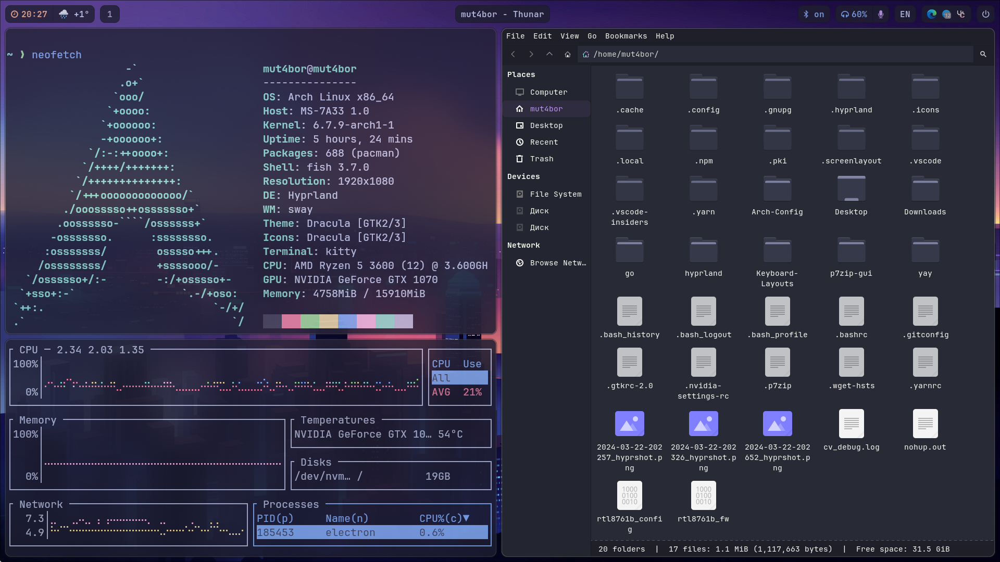
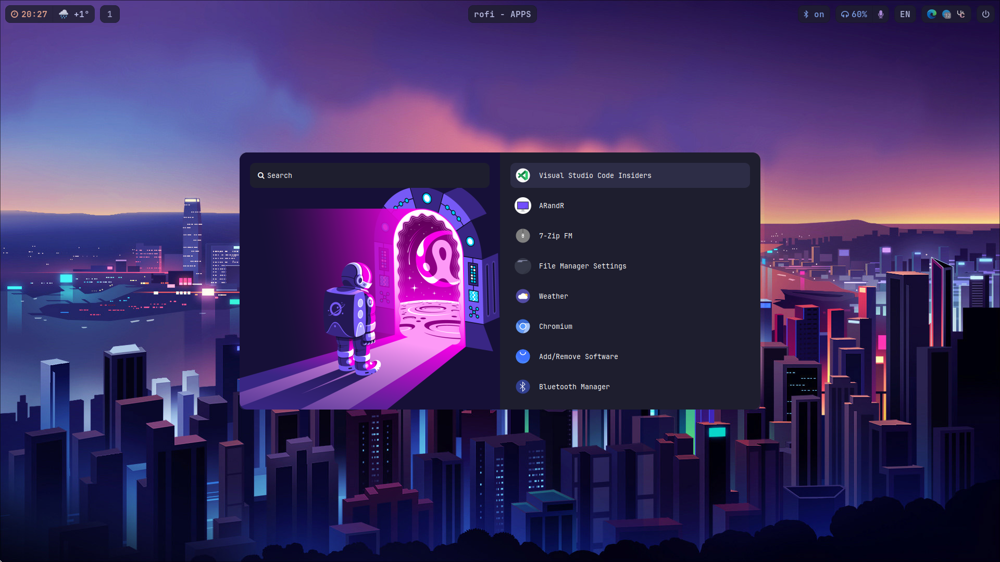
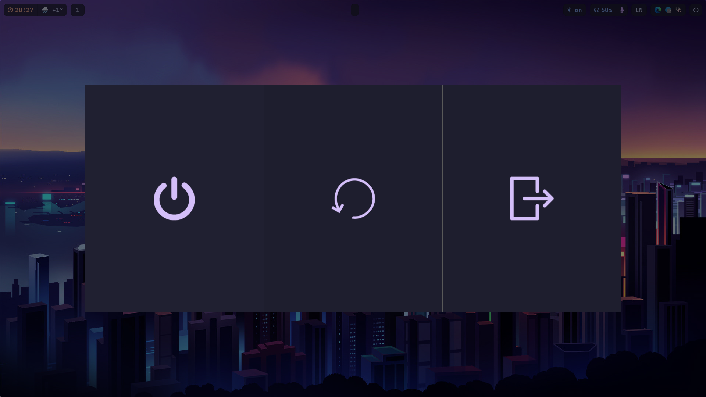

# Arch config

This is my Arch Hyprland config

- [Packages](#packages)
- [Setup](#setup)
  - [Config Setup](#config-setup)
  - [Autologin Setup](#autologin-setup)
- [Screenshots](#screenshots)

## Packages

- Hyprland
- Waybar
- sddm
- rofi
- dunst
- kitty
- fish

## Setup

#### Config Setup

```
git clone https://github.com/mut4bor/Arch-Config.git
cd Arch-Config
cp -r Arch-Config/.config/ ~/.config/
```

#### Autologin Setup

Copy file to sddm custom config directory

```
mkdir /etc/sddm.conf.d
cp autologin.conf /etc/sddm.conf.d/
```

Change `User=mut4bor` to `User=yourusername`

```
doas nano /etc/sddm.conf.d/autologin.conf
```

## Screenshots




